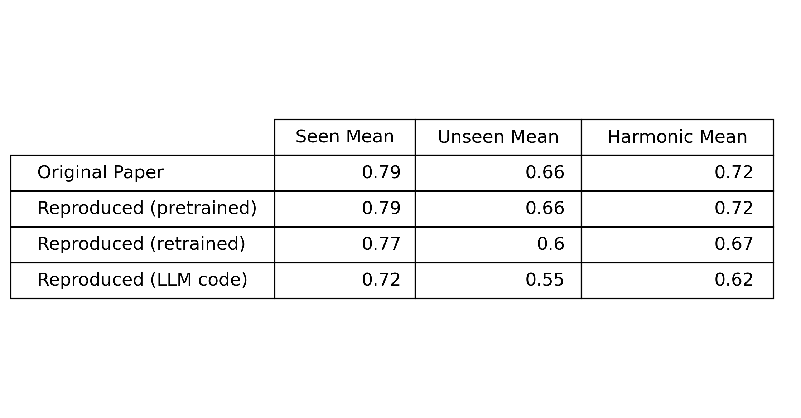
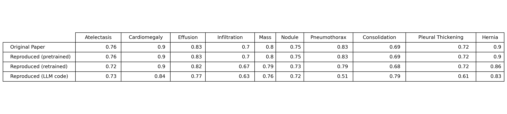
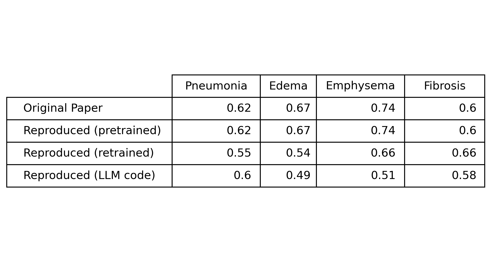
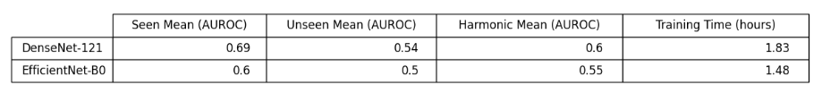

# Multi-Label Generalized Zero Shot Learning for Classifying Chest X-Rays

## Overview

This repository represents three attempts to reproduce the results of the paper, ["Multi-Label Generalized Zero Shot Learning for the Classification of Disease in Chest Radiographs"](https://arxiv.org/abs/2107.06563), specifically the AUROC scores. See the project [proposal](https://github.com/EricSchrock/cxr-ml-gzsl/blob/main/proposal/proposal.pdf) and [report](https://github.com/EricSchrock/cxr-ml-gzsl/blob/main/report/report.pdf) for greater detail. For a quick summary, see the project presentation in [slide](https://github.com/EricSchrock/cxr-ml-gzsl/blob/main/report/presentation.pptx) and [video](https://drive.google.com/file/d/1fTt2B8VNEQrtBT_Iooby2_viOujf59bX/view?usp=drive_link) form.

The first attempt used both the code and pre-trained weights [provided by the paper](https://github.com/nyuad-cai/CXR-ML-GZSL/). The provided conda environment no longer builds. Luckily, the code ran in a newer environment (details provided further down) with only four minor changes. First, I removed any unused imports. Second, I updated `roc_auc_score` to import from `sklearn.metrics` instead of `sklearn.metrics.ranking`. Third, I added the `weights_only=False` parameter to all `torch.load` calls. Fourth, I updated paths and file names in `NIHChestXray` and `argParser` to account for changes in the dataset and for my own dataset download code. This first attempt successfuly reproduced the AUROC scores from the paper, showing that the provided model code and weights match the paper.

The second attempt retrained the model using the provided code. Overall, the resulting AUROC scores were worse that those reported by the paper, though two of the fourteen classes had the same AUROC scores and one had better. There are many possible reasons I could not successfully retrain the model, but they fit into two buckets. First, the paper does not clearly list all hyperparameter values used. Second, the provided training code does not appear to be exactly what was used to generate the results from the paper. Below is a list of specific issues I found.

1. The provided code has two bugs. I fixed them for my training attempt.
   1. The alignment loss is hardcoded to `0.0`.
   2. The `ChexnetTrainer.train` function has an off by one error that stops training one epoch early.
2. The paper does not state which gamma1, gamma2, or learning rate values resulted in the provided AUROC scores. I used gamma values of `0.1` and a learning rate of `0.0001`, which matches the code defaults and the values the paper mentions in the section on "Ablation studies".
3. The paper does not state what batch sizes it used for the training, validation, or test datasets. I used the batch sizes hardcoded into the provided code.
4. Some of the hyperparameters in the provided code do not match the values stated in the paper. I used the values from the paper, not from the code.
   1. The paper says it trained for 100 epochs, but the provided code only trains for 40 epochs by default (see both `train_densenet121.sh` and `arguments.py`).
   2. The paper says it used a delta value of `0.5`, but the provided code has defaults of either `0.2` (see `train_densenet121.sh`) or `0.03` (see `arguments.py`).
   3. The paper says it used a patience of `10` and a factor of `0.01` for learning rate reduction, but the provided code is hardcoded to a patience of `5` and a factor of `0.1`. I used the values from the paper, not from the code.

Third, I attempted to rapidly reproduce the results from scratch with the help of an LLM, specifically `GPT-4-turbo`. This was part of a larger research project on effective vs ineffective ways to use LLMs and on whether LLMs make it easier to reproduce the findings of research papers. See [here](https://github.com/EricSchrock/cxr-ml-gzsl/blob/main/report/report-llm-chat-log-for-research.txt), for my LLM chat log. I was able to write the code for this attempt from scratch in about one and a half days, but the results were significantly worse than those from the first and second attempts. Only one of the fourteen classes had a better AUROC score. Clearly, my generated code does not match the paper or provided code, though it superficially appears to.

## Environment

The code from attempts one and two is found in `CXR_ML_GZSL.ipynb`. The code from attempt three is found in `cxr_ml_gzsl.ipynb`. Both notebooks provide further detail and instructions, as well as code to automatically download the dataset. I ran both on [Google Colab](https://colab.research.google.com/) with a PRO+ subscription to gain access to more system RAM, better GPUs, and longer runtime timeouts.

|                       | Original               | Attempts 1-2 | Attempt 3    |
|-----------------------|------------------------|--------------|--------------|
| GPU                   | NVIDIA Quadro RTX 6000 | NVIDIA A100  | NVIDIA A100  |
| GPU RAM usage (GB)    | Unknown                | 38.8         | 19.1         |
| System RAM usage (GB) | Unknown                | 24.6         | 22.5         |
| Training time (hours) | ~8                     | ~7.5         | ~8.5         |
| Python                | 3.6.12                 | 3.11.12      | 3.11.12      |
| matplotlib            | 3.3.3                  | 3.10.0       | 3.10.0       |
| numpy                 | 1.19.2                 | 2.0.2        | 2.0.2        |
| pandas                | 1.1.3                  | 2.2.2        | 2.2.2        |
| pillow                | 8.0.0                  | 11.1.0       | 11.1.0       |
| sklearn               | 0.23.2                 | 1.6.1        | 1.6.1        |
| torch                 | 1.4.0                  | 2.6.0+cu124  | 2.6.0+cu124  |
| torchvision           | 0.5.0                  | 0.21.0+cu124 | 0.21.0+cu124 |
| tqdm                  | 4.55.1                 | 4.67.1       | 4.67.1       |

**Note**: Training times do not include dataset download or evaluation times.

**Note**: Original Python and library versions based on the conda `environment.yml` file provided by the paper.

## Reproducing My Results with Pre-Trained Weights

To quickly reproduce my results, run `csr_ml_gzsl_pretrained.ipynb` to download pre-trained weights for all three attempts, run the models with these pre-trained weights, and report the results. In my testing, this took about an hour, mostly spent downloading the dataset. I ran it on an NVIDIA A100 and it required 10.1 GB of GPU RAM and 20.8 GB of System RAM.

**Note**: If you get an error when loading the pretrained weights, it's possible they got corrupted during the download. You can manually download them at the following links.

1. https://drive.google.com/file/d/17ioJMW3qNx1Ktmr-hXn-eqp431cm49Rm/view
2. https://drive.google.com/file/d/1uHeDxHagEPCvGcHOOI_urj4cNYPliqG1/view?usp=drive_link
3. https://drive.google.com/file/d/1Y-VvHo7b_yok_eSjiHQqbTPXFMtFb4k9/view?usp=drive_link

## Results (AUROC)

### Overall

### Classes Seen During Training

### Classes Excluded from Training

## Extension

I also extended the findings of the paper in question by replacing DenseNet-121 with EfficientNet-B0 and comparing the AUROC scores and training time. Due to a looming project deadline, I trained the model on half the dataset and for half the number of epochs (50). See `cxr_ml_gzsl_extension.ipynb` for more details.

## Reproducing My Extension Results with Pre-Trained Weights

To quickly reproduce my extension results, run `csr_ml_gzsl_extension_pretrained.ipynb` to download pre-trained weights, run the models with these pre-trained weights, and report the results. In my testing, this took about 10 minutes, though dataset download times can vary dramatically. I ran it on an NVIDIA A100 and it required 8.8 GB of GPU RAM and 15.5 GB of System RAM.

**Note**: If you get an error when loading the pretrained weights, it's possible they got corrupted during the download. You can manually download them at the following links.

1. https://drive.google.com/file/d/1rzvBXBX8u3Yv22ACe2qGeEpMffF6uwNh/view?usp=drive_link
2. https://drive.google.com/file/d/14flyOtpZGwBDP0pPHxHkqZWtbE-8JcNP/view?usp=drive_link

## PyHealth Contribution

An additional part of my project was to contribute to the [PyHealth](https://github.com/sunlabuiuc/PyHealth/) open source project. I submitted a PR to add the [NIH chest X-ray dataset](https://arxiv.org/abs/1705.02315) to the project. I used `PyHealth.ipynb` to test my contribution.

PR: https://github.com/sunlabuiuc/PyHealth/pull/392
